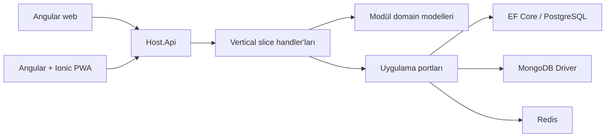

# Sistem genel bakışı

## Çalışan ürün sınırı

Depo başlangıçta ürün çözümü içermiyordu. Bugünkü tek composition host aşağıdaki çalışan bounded context'leri bir araya getirir:

- Identity: kayıt, giriş, refresh-token rotation ve reuse detection, çıkış ve cihaz oturumları;
- Profiles: profil, görünürlük ve kullanıcı tercihleri;
- SocialGraph: takip isteği, takip, engel, sessize alma ve yakın çevre;
- Questions: anonimlik korumalı soru, gelen kutusu, yanıt ve arşiv;
- Content: metin ve medya metadata'sı, taslak/zamanlama/yayınlama, görünürlük, revizyon, arşiv ve tombstone;
- Reactions ve Comments: idempotent tepki, tekillik, iç içe yorum ve iyimser eşzamanlılık;
- Feed: takip, profil ve keşif akışları; görünürlük süzme, açıklanabilir deterministik sıralama, cursor ve Redis önbelleği.
- Messaging: doğrudan/grup konuşmaları, üyelik rolleri, kalıcı mesaj/receipt, SignalR ve Redis backplane;
- Notifications: aggregation, cursor inbox, SignalR, kanal retry ve dead-letter.

`src/Host/Api/Program.cs` composition root'tur. Endpoint'ler HTTP DTO'larını komutlara çevirir; iş kuralı içermez. Domain ve Application projeleri ASP.NET Core, EF Core, MongoDB, Redis veya dosya sistemi referansı taşımaz. Mimari testler bu bağımlılık yönünü otomatik denetler.

## Modül sahipliği

Her modül kendi aggregate, port, persistence ayarı ve verisini sahiplenir. Örneğin Content, SocialGraph repository'sine erişmez; yalnızca `ISocialGraphModule` public contract'ını kullanır. Reactions ve Comments de içerik görünürlüğünü `IContentModule` üzerinden sorar. Böylece başka bir modülün tablosuna veya koleksiyonuna doğrudan sorgu kurulmaz.

PostgreSQL ve MongoDB seçimi `Modules:<Module>:Persistence:Provider` ayarıyla yapılır. Uygulama handler'ları değişmez. Sağlayıcı sözleşme testleri create/select/filter/sort/cursor/update/concurrency/delete davranışlarının aynı olduğunu gerçek konteynerlerde kanıtlar.

## Henüz tamamlanmamış sınırlar

Communities, Media, Search, Moderation, Administration ve Audit modülleri ile kapsamlı yük testleri sonraki dikey artımlarda tamamlanacaktır. Bu belge yalnızca çalışan kodu tamamlanmış olarak adlandırır.
