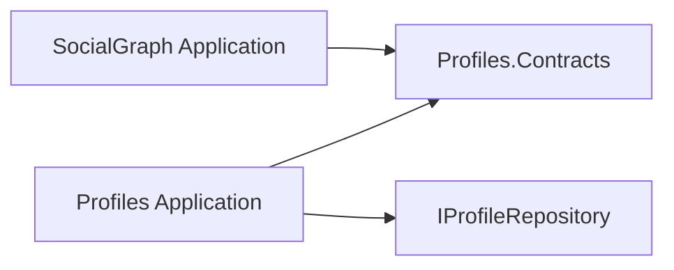

# DDD bounded contextleri

## Identity

Identity kimlik doğrulama verisini, parola özetlerini, hesap kilidini ve cihaz session'larını sahiplenir. `UserAccount` başka modüllerin public profil modeli değildir. Refresh token rotation/reuse detection `UserSession` aggregate'inde korunur.

## Profiles

Profiles kullanıcının dışarıya gösterilen kimliğini sahiplenir: handle, görünen ad, biyografi, konum, organizasyon, HTTPS bağlantısı, medya kimlikleri, gizlilik, tema, dil ve erişilebilirlik tercihi. Identity `UserId` tipi doğrudan paylaşılmaz; JWT subject GUID değeri API adaptöründe `ProfileOwnerId` değerine çevrilir.

`Profile` aggregate'i handle/display-name uzunluklarını, izin verilen handle karakterlerini ve yalnız HTTPS web adresini korur. Profil tamlık oranı persist edilen serbest bir sayaç değil, aggregate durumundan deterministik hesaplanan bir değerdir.

## SocialGraph

SocialGraph yönlü ilişkileri sahiplenir. `(ActorId, TargetId)` benzersizdir; ters yön ayrı aggregate'dir. `Relationship` şu invariantları korur:

- kişi kendisini takip/engelleme hedefi yapamaz;
- özel hedef follow isteğini `Pending`, açık hedef doğrudan `Following` yapar;
- yalnız pending istek kabul edilebilir;
- block follow, mute ve close-friend durumunu temizler;
- close-friend yalnız aktif follow üzerinde kurulabilir;
- tekrarlanan follow/block/mute çağrıları idempotenttir.

## Modüller arası sözleşme

SocialGraph, Profiles repository veya DbContext'ini kullanmaz. `Profiles.Contracts/IProfilesModule.cs` üzerinden yalnız hedef profil varlığı ve `IsPrivate` bilgisi istenir:

Bu yön, aynı process içindeki senkron modül çağrısıdır. Modül ayrıştırılırsa contract'ın uygulaması HTTP/gRPC adaptörüne çevrilebilir; SocialGraph domain/handler kodu değişmez.

## Kalıcılık sahipliği

PostgreSQL'de `profiles.profiles` ve `social_graph.relationships` ayrı şemalardadır. MongoDB'de varsayılan olarak ayrı module database adları kullanılır. Her iki modül kendi unique/query indexlerini başlangıçta idempotent kurar ve provider yalnız typed configuration/DI ile seçilir.
