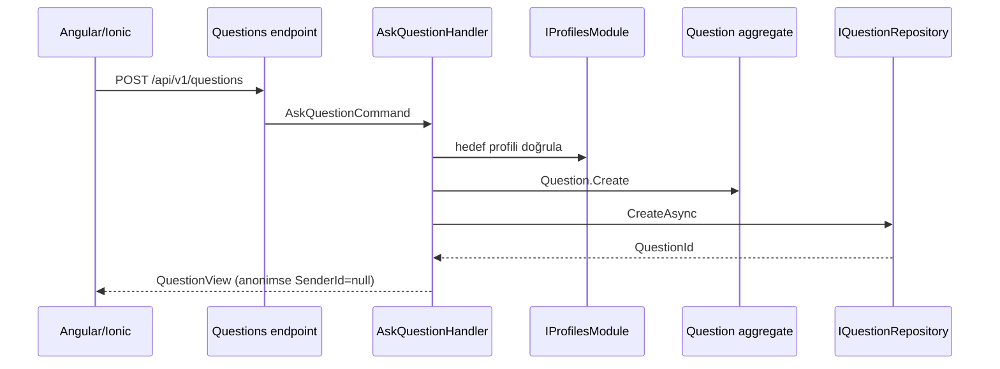

# Questions bounded context öğrenme rehberi

## Sınır ve dil

Questions modülü bir profil sahibine yöneltilen soru ile bunun yaşam döngüsünü sahiplenir. Identity kimlik doğrulamayı, Profiles hedef profil bulunabilirliğini, Questions ise soru metni, anonimlik, hedef, yayın durumu ve yanıt yetkisini yönetir. Application katmanı Profiles iç modeline veya repository'sine erişmez; yalnız `IProfilesModule` public contract'ını çağırır.

## Anonimlik güvenlik modeli

`Question.SenderId` moderasyon ve kötüye kullanım incelemesi için kaynak veride korunur. Normal `QuestionView` eşlemesi `IsAnonymous` doğruysa bu alanı koşulsuz `null` yapar. Bu karar endpoint'e bırakılmamıştır; bütün normal kullanıcı akışları aynı merkezi mapper'dan geçer. MongoDB/PostgreSQL repository portları aggregate döndürür, fakat kalıcı model doğrudan HTTP cevabı yapılmaz.

Normal kullanıcıya rastgeleleştirilmiş başka bir gönderici anahtarı da verilmez. Böyle bir anahtar farklı anonim soruları ilişkilendirerek dolaylı kimlik sızıntısı yaratabilirdi. İleride moderasyon dilimi yalnız yetkili policy ile ayrı ve denetlenen bir iz görünümü sunacaktır.

## Aggregate invariants

- yalnız hedef profil yayınlanmış soruyu yanıtlar;
- draft, scheduled, archived veya deleted soru yanıtlanamaz;
- planlanan zaman UTC saate göre gelecekte olmalıdır;
- silme fiziksel kayıt kaldırmaz, metni boşaltıp tombstone durumuna geçirir;
- optimistic concurrency için her durum değişimi `Version` artırır;
- gönderen ve hedef dışındaki aktör arşivleme/silme yapamaz.

`PublishDue` injected `IClock` üzerinden çağrılır. Böylece testler sistem saatine bağlı değildir. Planlı bir soru gelen kutusunda vadesi dolduğunda `Scheduled` durumundan `Published` durumuna geçirilir ve yeni sürüm repository'ye beklenen eski sürümle yazılır.

## İki persistence adapterı

`IQuestionRepository`, ortak `IRepository<Question, QuestionId>` sözleşmesini genişletir. Filtreler `Expression<Func<Question,bool>>` olarak Application'dan çıkar. PostgreSQL adapterı ifadeyi EF Core'a, MongoDB adapterı resmi driver'a verir; driver nesnesi porttan dışarı çıkmaz.

PostgreSQL `questions` şemasını ve `QuestionsDbContext`'i kullanır. Gelen kutusu için `(TargetId, Status, CreatedAtUtc)`, gönderen geçmişi için `(SenderId, CreatedAtUtc)` indexleri migration içinde üretilmiştir. MongoDB aynı sorgu yönlerini `ix_inbox` ve `ix_sender` compound indexleriyle karşılar. Her iki adapter deterministik sıralamanın sonuna `Id` ekler.

Provider seçimi `Modules:Questions:Persistence:Provider` üzerinden yapılır. `DependencyInjection.AddQuestionsModule` yalnız composition root'ta bu değeri okuyup doğru adapterı kaydeder. Domain/Application kodu değişmez.

## UI akışı ve optimistic rollback

OpenAPI sözleşmesi `contracts/openapi/api-v1.yaml` içindedir ve Angular fonksiyonları üretilir. Web `QuestionsPage`, mobil `MobileQuestionsPage` aynı sözleşmeyi fakat farklı görsel bileşenleri kullanır. Yanıt düğmesi listeyi hemen `Answered` gösterir; sunucu authorization veya concurrency nedeniyle reddederse önceki signal snapshot'ı geri yüklenir.

## Test senaryoları

Unit testleri hedef dışındaki aktörün yanıtını, erken scheduled yayını ve tombstone davranışını doğrular. Ortak repository contract testi aynı create/select/sort/update/concurrency/duplicate/delete gözlemlerini PostgreSQL ve MongoDB üzerinde çalıştırır. Gerçek API kabulünde her iki provider için anonim soru yaratıldı, hedef gelen kutusuna düştü, `senderId` hem create hem inbox yanıtında `null` kaldı ve hedef kullanıcı soruyu yanıtladı.

## Görüşme soruları

**Anonim gönderen neden domain modelinden tamamen silinmedi?** Moderasyon ve kötüye kullanım soruşturması için kontrollü iz gerekir. Gizlilik, kaynak veriyi yok etmek yerine authorization ve ayrı DTO sınırıyla sağlanır.

**Neden hard delete kullanılmadı?** Yanıt zinciri, itiraz ve denetim bütünlüğü korunmalıdır. Privacy erasure ayrı, yetkili ve ölçülebilir bir workflow olmalıdır.

**Neden `IQueryable` dönmüyor?** Application'ın provider'a özgü sorgu davranışı kurmasını ve sınırsız sorgu üretmesini engellemek için repository sınırı expression, bounded limit ve deterministik sort ile kısıtlanır.

## Sorun giderme

- Host başlangıcında options validation hatası: `Modules:Questions:Persistence` bölümündeki provider ve connection değerlerini kontrol edin.
- Mongo sıralama hatası: sort ifadesinin driver tarafından çevrilebilir basit aggregate property olması gerekir.
- 409 concurrency: istemci görünümü yeniden okumalı ve kullanıcı değişikliğini yeni `Version` üzerinden tekrarlamalıdır.
- Anonim yanıtta `senderId` görünürse bu bir güvenlik olayıdır; `AskQuestionHandler.Map` dışından entity döndüren endpoint olup olmadığını hemen denetleyin.
